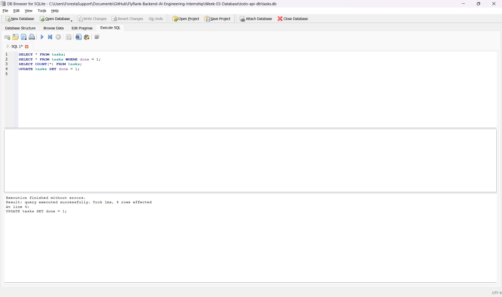

# Task API — with SQLite Database

A CRUD API for managing a to-do list, built with FastAPI (Python) and backed by a SQLite database. This is the sequel to Assignment 1 — the same endpoints, but now the data survives a server restart.

## Why SQLite?

SQLite was chosen because it needs zero setup — no separate database server to install or run. The entire database lives in a single file (`tasks.db`), which is created automatically the first time the app runs. This makes it perfect for small projects and learning, while still being real SQL.

## Where the database lives

The database file `tasks.db` is created automatically in the project folder when the app starts. It is git-ignored, so each fresh clone of this repo starts with a clean database (the table and 3 example tasks are recreated automatically).

## How to run this project

1. Clone the repository and navigate to this folder:
```
cd Week-03-Database/todo-api-db
```

2. Create and activate a virtual environment:
```
python -m venv venv
venv\Scripts\activate
```

3. Install dependencies:
```
pip install fastapi uvicorn
```

4. Run the server:
```
uvicorn main:app --reload
```

5. The API will be running at `http://127.0.0.1:8000`. The database (`tasks.db`) and the `tasks` table are created automatically, with 3 example tasks seeded on first run.

## Endpoints

| Method | Endpoint | Description | Success Code | Error Codes |
|--------|----------------------|-------------------------------------|---------------|--------------|
| GET | `/` | API info | 200 | - |
| GET | `/health` | Health check | 200 | - |
| GET | `/tasks` | List all tasks | 200 | - |
| GET | `/tasks/{task_id}` | Get a single task | 200 | 404 |
| POST | `/tasks` | Create a new task | 201 | 400 |
| PUT | `/tasks/{task_id}` | Update a task's title/done status | 200 | 400, 404 |
| DELETE | `/tasks/{task_id}` | Delete a task | 204 | 404 |

## Example curl output

```
curl -i -X POST http://127.0.0.1:8000/tasks -H "Content-Type: application/json" -d "{\"title\":\"Test persistence\"}"

HTTP/1.1 201 Created
content-type: application/json

{"id":4,"title":"Test persistence","done":false}
```

## Proving persistence

Created a task via POST, then stopped and restarted the server. Running `GET /tasks` again showed the task was still there — because it now lives in `tasks.db` on disk instead of in memory.

## Exploring the database with DB Browser for SQLite

Opened `tasks.db` directly in DB Browser for SQLite and ran SQL queries by hand in the "Execute SQL" tab:

```sql
SELECT * FROM tasks;
SELECT * FROM tasks WHERE done = 1;
SELECT COUNT(*) FROM tasks;
UPDATE tasks SET done = 1;
```

**Example query run:** `UPDATE tasks SET done = 1;` → Result: "query executed successfully, 4 rows affected".

After clicking "Write Changes" in DB Browser, calling `GET /tasks` from the API immediately showed all tasks with `done: 1` — no server restart needed. This proved that the API and DB Browser were reading and writing the exact same file, with no syncing involved.

### Screenshot



## What changed from Assignment 1

Only the storage layer changed — an in-memory list was replaced with SQL queries against a SQLite database using parameterized queries (`?` placeholders) to keep it safe. The API's routes, request/response shapes, and status codes are all identical to Assignment 1.
