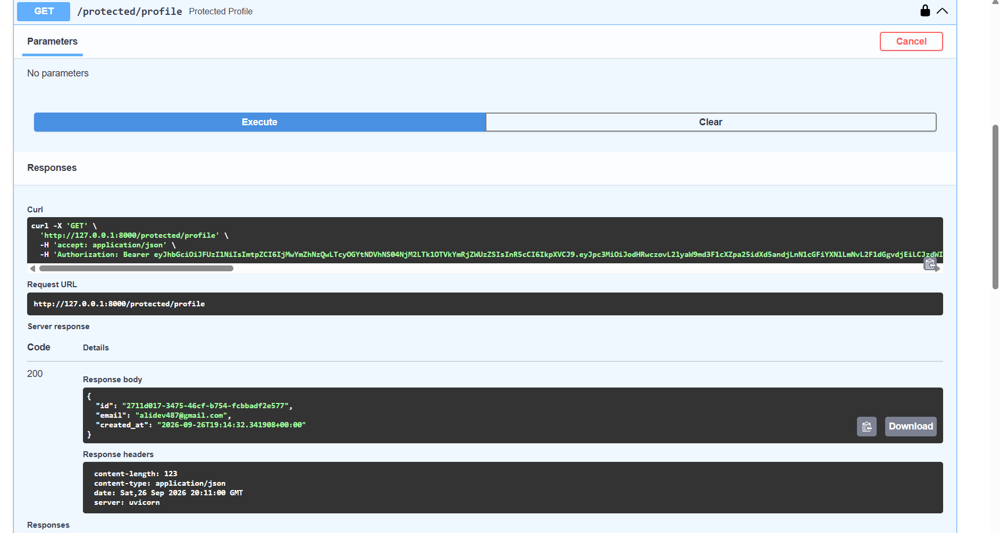

# Auth API — Login & Protect (Supabase)

A secure FastAPI backend using **Supabase Auth** for user signup, login, logout, and protected routes via JWT bearer tokens.

---

## 📌 Project Overview

This project is part of the **FlyRank Backend AI Engineering Internship — Week 4 (Auth · Login & Protect)** assignment. It demonstrates a complete authentication flow:

- Users sign up and log in through **Supabase**, which issues a JWT (access token).
- The client sends this token to the backend in the `Authorization` header.
- The backend verifies the token with Supabase before allowing access to protected routes.
- A reusable dependency (`verify_token`) guards multiple protected endpoints without duplicating logic.

---

## 🛠️ Tech Stack

- **Framework:** FastAPI
- **Identity Provider:** Supabase Auth
- **Language:** Python 3.10+
- **Docs:** Swagger UI (built-in via FastAPI, with Bearer auth support)

---

## ⚙️ Setup Instructions

### 1. Navigate to the project folder
```bash
cd Week-04-Auth/auth-login-protect
```

### 2. Create and activate a virtual environment
```bash
python -m venv venv
venv\Scripts\activate      # Windows
# source venv/bin/activate   # Mac/Linux
```

### 3. Install dependencies
```bash
pip install -r requirements.txt
```

### 4. Configure environment variables
Copy `.env.example` to `.env` and fill in your own Supabase project details:
```
SUPABASE_URL=your_project_url
SUPABASE_KEY=your_anon_key
PORT=8000
```

### 5. Run the server
```bash
uvicorn main:app --reload --port 8000
```

You should see:
```
Server running and connected to Supabase
```

---

## 📚 API Reference

| Method | Endpoint                 | Auth Required | Description                          |
|--------|---------------------------|:--------------:|---------------------------------------|
| POST   | `/auth/signup`             | No             | Create a new user account             |
| POST   | `/auth/login`              | No             | Log in and receive a JWT              |
| POST   | `/auth/logout`             | Yes            | Terminate the user session            |
| GET    | `/public/info`             | No             | Public, unprotected data              |
| GET    | `/protected/profile`       | Yes            | Read authenticated user's profile     |
| GET    | `/protected/dashboard`     | Yes            | Another protected route (same guard)  |

**Auth header format:**
```
Authorization: Bearer <your_access_token>
```

---

## 🧪 Testing with curl

**Sign up:**
```bash
curl -i -X POST http://127.0.0.1:8000/auth/signup -H "Content-Type: application/json" -d "{\"email\":\"test@example.com\", \"password\":\"password123\"}"
```

**Log in:**
```bash
curl -i -X POST http://127.0.0.1:8000/auth/login -H "Content-Type: application/json" -d "{\"email\":\"test@example.com\", \"password\":\"password123\"}"
```

**Access a protected route:**
```bash
curl -i http://127.0.0.1:8000/protected/profile -H "Authorization: Bearer <access_token>"
```

**Log out:**
```bash
curl -i -X POST http://127.0.0.1:8000/auth/logout -H "Authorization: Bearer <access_token>"
```

---

## 📖 Swagger UI

Interactive API docs are available at:
```
http://127.0.0.1:8000/docs
```

1. Click the **Authorize** 🔒 button (top right).
2. Paste your access token (no `Bearer ` prefix needed).
3. Click **Authorize**, then **Close**.
4. Expand any protected route → **Try it out** → **Execute**.



---

## 🔒 Security Notes

- Passwords are never handled or stored directly — Supabase manages hashing and storage.
- The `.env` file (containing real Supabase keys) is git-ignored and never committed.
- Only the **anon/publishable key** is used in this app — the `service_role`/secret key is never exposed client-side.
- Tokens are verified server-side on every protected request via `supabase.auth.get_user(token)`.

---

## ✅ Status Codes Reference

| Code | Meaning                          |
|------|----------------------------------|
| 200  | OK — successful request          |
| 201  | Created — new resource (signup)  |
| 204  | No Content — successful logout   |
| 400  | Bad Request — missing input      |
| 401  | Unauthorized — missing/invalid/expired token |

---

## 👤 Author

Built as part of the FlyRank Backend AI Engineering Internship — Week 4 Assignment.
